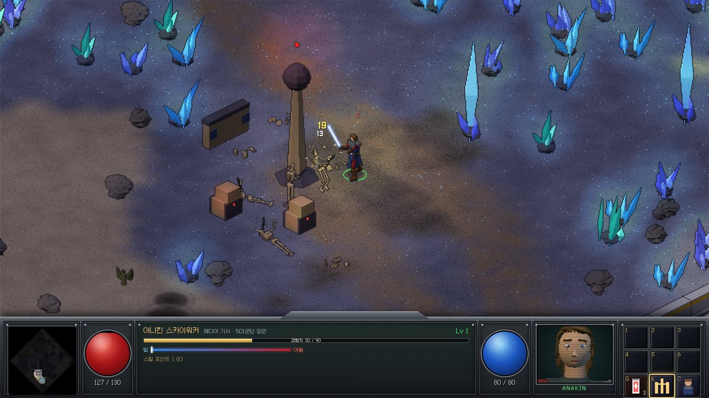
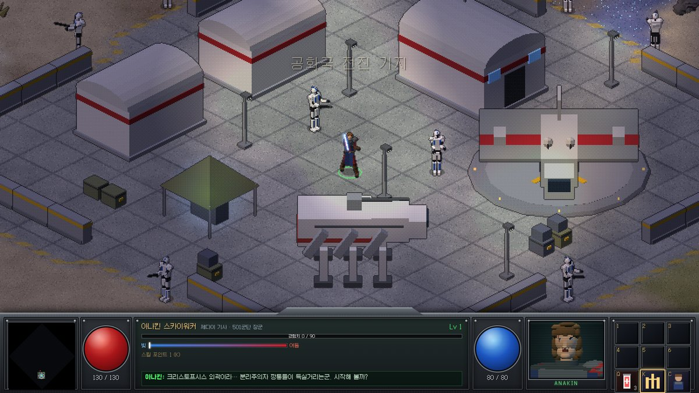
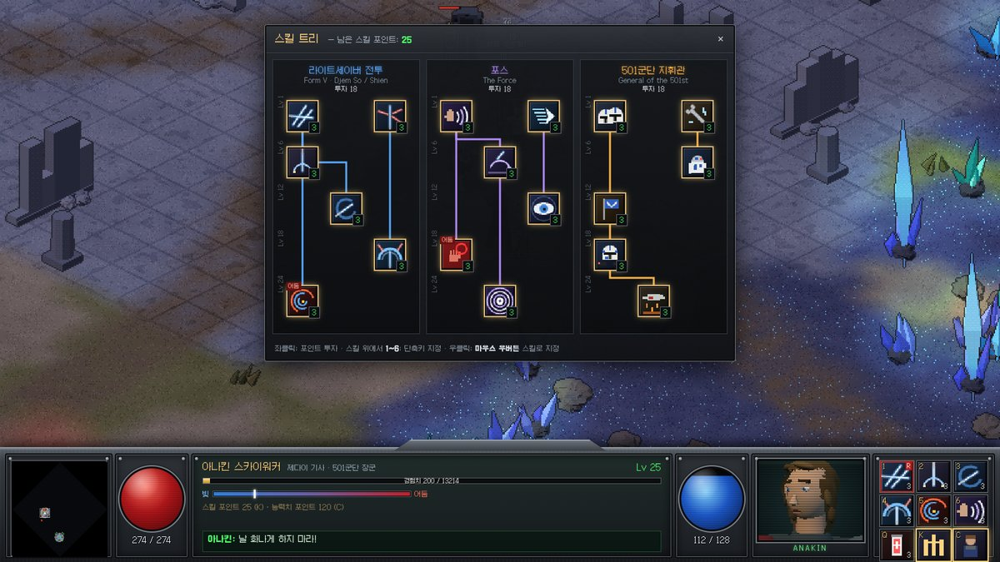
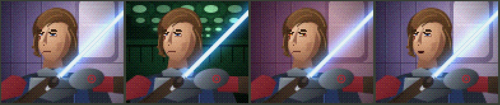

# CLONE WARS: 선택받은 자 (Isometric RPG)

스타워즈 **클론 전쟁**을 배경으로 한 올드스쿨 아이소메트릭 핵 앤 슬래시 RPG 프로토타입.
디아블로 2의 조작/성장 구조에, **배틀프론트 2 · 제다이: 서바이버** 스타일의 미니멀 HUD.
주인공은 클론 전쟁 갑옷을 입은 **아나킨 스카이워커**입니다.

- 장르: 디아블로식 액션 RPG (클릭 이동/공격, 스킬 트리, 능력치, 드롭)
- 배경: 크리스토프시스 외곽 오픈월드 (192×192 타일) — 공화국 전진 기지, 수정 평원, 고대 도시 폐허, 드로이드 공장
- 그래픽: 스타크래프트 1 / 디아블로 2 / C&C처럼 **3D 모델을 사전 렌더링한 픽셀 스프라이트** — 단, 외부 이미지 없이 로딩 시 브라우저에서 직접 렌더링



| 공화국 전진 기지 | 스킬 트리 |
| --- | --- |
|  |  |

초상화 (레퍼런스 구도 기반 픽셀 아트 — 함선 복도 / 드로이드 공장 격납고 / 어둠 게이지 상승 / 대사 중):



자세한 기획(스킬 트리 전체, 시스템, 로드맵)은 [`docs/GAME_DESIGN.md`](docs/GAME_DESIGN.md)를 참고하세요.

## 실행

```bash
npm install
npm run dev        # http://localhost:5173
npm run build      # dist/ 에 정적 빌드
npm run preview
```

첫 로딩 시 모든 캐릭터·오브젝트를 3D로 렌더링해 스프라이트 아틀라스를 굽습니다 (수 초 소요).

## 📱 휴대폰에서 플레이 (설치형 웹 앱)

이 게임은 **PWA(설치형 웹 앱)** 입니다. 휴대폰 브라우저에서 열고 홈 화면에 추가하면 아이콘으로 실행되는 전체 화면 앱이 되고, 한 번 연 뒤에는 오프라인에서도 실행됩니다.

1. **배포 (최초 1회)**: GitHub 저장소 → Settings → Pages → Build and deployment → Source를 **GitHub Actions**로 설정.
   이후 이 브랜치에 푸시할 때마다 `.github/workflows/deploy-pages.yml`이 빌드해서 배포합니다.
   (이미 실패한 워크플로가 있으면 Actions 탭에서 **Re-run** 하세요.)
2. 휴대폰에서 `https://geroroy.github.io/Isometric-RPG/` 접속
3. **안드로이드(Chrome)**: 메뉴 ⋮ → **홈 화면에 추가 / 앱 설치**
   **아이폰(Safari)**: 공유 버튼 → **홈 화면에 추가**
4. 홈 화면의 Clone Wars 아이콘으로 실행 → **가로 화면**으로 플레이

휴대폰 기본 화면 배율은 **갤럭시 S25 Ultra(가로)** 기준으로 맞춰져 있습니다 (세로로 약 240 게임 픽셀이 보이도록). 핀치나 − + 버튼으로 50%~250% 사이에서 조절하면 기기에 저장됩니다.

설치하지 않고 브라우저에서 바로 할 때는 시작 버튼을 누르면 자동으로 전체 화면이 됩니다 (안드로이드). 아이폰 Safari는 웹 페이지의 전체 화면을 지원하지 않으므로 홈 화면에 추가해서 실행하세요.

### 터치 조작

| 입력 | 동작 |
| --- | --- |
| 왼쪽 화면 드래그 | 가상 스틱으로 이동 (짧게 탭하면 그 위치로 이동 / 적을 탭하면 공격) |
| 공격 버튼 (오른쪽 아래) | 누르고 있으면 가장 가까운 드로이드를 계속 공격 |
| 스킬 버튼 탭 | 가까운 적에게 자동 조준해 시전 |
| 스킬 버튼 드래그 | 바닥에 조준선이 표시됨 → 손을 떼면 그 방향/위치로 시전 (포스 도약, LAAT 공습은 끄는 거리만큼) |
| 박타 버튼 | 생명력 회복 |
| 두 손가락 핀치 | 화면 확대·축소 (설정은 저장됨) |
| 오른쪽 위 버튼 | 스킬 · 정보 · 지도 · 설정 · − + 확대/축소 · 전체 화면 |
| 스킬 트리 | 스킬을 탭해 선택 → **투자** 또는 같은 스킬을 한 번 더 탭 · 숫자 버튼으로 스킬 버튼 슬롯 지정 |

## 조작 (PC)

| 입력 | 동작 |
| --- | --- |
| 좌클릭 (홀드) | 이동 / 적 공격 |
| Shift + 좌클릭 | 제자리 공격 |
| 우클릭 (홀드) | 지정 스킬 시전 (명령 카드의 **R** 슬롯) |
| 1 ~ 6 | 단축키 스킬 시전 |
| Q | 박타 주사기 |
| K / T | 스킬 트리 · 스킬 위에서 1~6 = 단축키 지정, 우클릭 = 우버튼 지정 |
| O | 설정 (초상화 사진 · 소리) |
| C | 캐릭터 능력치 |
| Tab | 자동 지도 · 미니맵 클릭 = 이동 |
| F | 전체 화면 켜기/끄기 (오른쪽 위 ⛶ 버튼과 같음, Esc로도 해제) |
| 마우스 휠 / `-` `=` / `0` | 화면 확대·축소 / 기본 배율 (오른쪽 위 − + 버튼과 같음) |
| M / F1 | 음소거 / 도움말 |
| F9 | 개발자용: +5 레벨 (스킬 빠르게 테스트) |

초상화를 클릭하면 아나킨이 말합니다.

## 주요 기능 (M1)

- **아나킨 스카이워커**: 참고 이미지 기반 클론 전쟁 갑옷(건메탈 흉갑, 공화국 문장 폴드런, 남색 태버드, 버건디 튜닉, 갈색 건틀릿·부츠) 로우폴리 모델 → 16방향 × 8종 애니메이션
- **3개 스킬 트리 · 18 스킬** (전부 구현)
  - 라이트세이버 전투 (Form V 젬 소/쉬엔): 세이버 연격, 쉬엔 반사, 젬 소 내려치기, 세이버 투척, 쉬엔 방벽, 선택받은 자의 분노
  - 포스: 포스 푸시, 포스 스피드, 포스 도약, 포스 예지, 포스 초크, 포스 리펄스
  - 501군단 지휘관: 클론 트루퍼 호출, 기계공의 손길, R2-D2 지원, 전술 지휘, 렉스 대위, LAAT 공습
- **블래스터 볼트 반사**: 드로이드의 볼트를 광선검으로 튕겨내고, 숙련되면 사수에게 되돌려 보냄
- **빛/어둠 게이지**: 어둠의 기술은 강하지만 게이지가 오르면 초상화의 눈이 시스의 노란색으로 변함
- 적: B1 전투 드로이드, B2 슈퍼 배틀 드로이드, 거점별 정예, 드로이드 공장 수호자
- 디아블로식 라이트맵 조명, 광선검 글로우/궤적, 파티클, 화면 흔들림
- **휴대폰 지원**: 가상 스틱 + 공격/스킬 버튼(드래그 조준), 모바일 HUD, 설치형 앱(PWA, 오프라인 캐시, 가로 고정)
- **HUD (배틀프론트 2 / 제다이: 서바이버 스타일)**: 왼쪽 아래 초상화 + 기울어진 체력 바(피해 잔상) · 분할된 포스 바 · 박타 · 빛/어둠 게이지, 오른쪽 아래 어빌리티 카드(쿨다운 숫자·RMB 표시), 왼쪽 위 원형 레이더, 오른쪽 위 목표 추적(가장 가까운 거점 방향·거리), 화면 아래 영화식 자막, 노드형 스킬 트리 · 정보 · 지도 · 설정 전체 화면 메뉴(메뉴를 열면 일시정지)
- **사진 초상화**: 설정(⚙ / `O`)에서 원하는 사진을 고르면 HUD 초상화가 실사 사진이 됩니다(확대·위치 조절, 숨쉬는 듯한 움직임, 어둠 게이지에 따른 색 보정, 피격 시 붉은 번쩍임). 사진은 그 기기에만 저장됩니다. 배포본에 넣으려면 `public/portrait/anakin.jpg`로 두면 됩니다(사용 권한이 있는 사진만). 사진이 없으면 레퍼런스 구도로 그린 픽셀 아트 초상화가 나옵니다
- 절차적 지형(바이옴 블렌딩·디더링), 지역 배너, 자동 지도
- WebAudio 절차적 효과음: 광선검은 원작 제작 방식처럼 모터 험 + 휘두를 때 도플러(피치·밝기) 변화로 합성, 점화 "스냅-히스", 반사 크랙클
- **사운드 뱅크 슬롯**: `public/audio/index.json`에 직접 준비한(사용 권한이 있는) 효과음·대사 음성 파일을 등록하면 합성음 대신 재생되고, 대사는 자막과 함께 상황에 맞게 나옵니다 → [`public/audio/README.md`](public/audio/README.md)

## 구조

```
src/
  main.js               부트스트랩 & 게임 루프
  core/                 수학/노이즈, 아이소 투영, 입력, 오디오
  gfx/
    baker.js            3D → 스프라이트 베이커 (트림, 디더링, 외곽선, 아틀라스 패킹, 마커)
    models/             Three.js 모델: 리그, 캐릭터, 애니메이션, 소품
    assets.js           로딩 시 전체 베이킹
    terrain.js          청크 단위 픽셀 지형
    renderer.js         깊이 정렬, 라이트맵, 가산 글로우
    portrait.js         HUD 초상화: 사진 모드 + 픽셀 아트 대체 초상화
    fx.js               파티클/충격파/번개/텍스트
  world/                월드 생성, A* 길찾기
  game/                 게임 규칙, 유닛 AI, 스킬 트리, 대사
  ui/                   HUD(콘솔·패널·툴팁·미니맵), 픽셀 아이콘
debug.html              스프라이트 시트 확인용 (?m=anakin|clone|rex|b1|b2|r2)
debug-portrait.html     픽셀 초상화 변형(배경·어둠·대사) 확인용
```

## 예정 기능

- **무비 듀얼 모드**: 영화 속 1:1 광선검 결투 재현 (두쿠·벤트레스·오비완), 평정 게이지·흘리기·칼날 겨루기
- **스테이지 셀렉션**: 홀로테이블에서 영화/시리즈 속 전투(크리스토프시스, 지오노시스, 테스, 라이로스, 인비저블 핸드, 무스타파)를 골라 재현

설계는 [`docs/GAME_DESIGN.md` 9장](docs/GAME_DESIGN.md#9-게임-모드-예정)에 있습니다.

## 참고

비상업 팬 프로젝트입니다. Star Wars 및 관련 명칭은 Lucasfilm Ltd.의 상표입니다.
UI 폰트: [Galmuri](https://github.com/quiple/galmuri) (SIL OFL 1.1).
